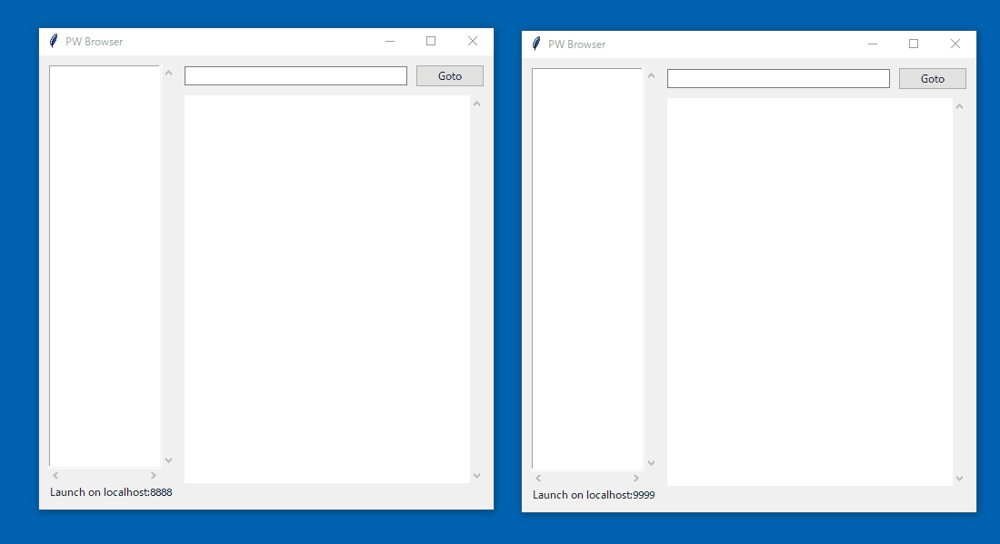

# P2P Web

Implementation of P2P web network with PW Browser.

PW Browser launches Peer clients and can get other hosts public content.
The user launches PW Browser and deploys website contents in the `public` directory then can publish the website.

# TODO

* NAT traverse
* 強化 of the browser.
